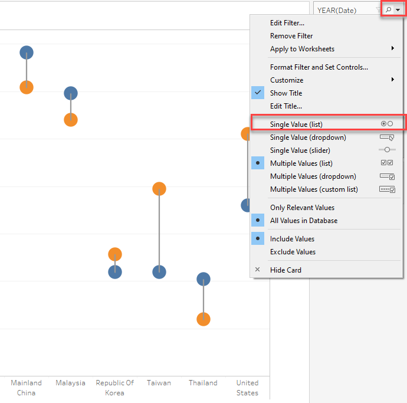
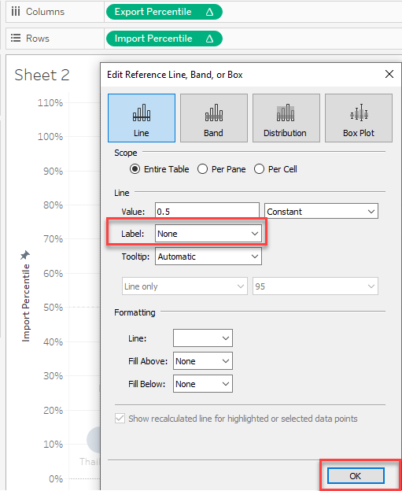

```{r setup, include=FALSE}
knitr::opts_chunk$set(echo = FALSE)
```

In this DataViz Makeover, I have used data  [*Merchandise Trade by Region/Market*](https://www.singstat.gov.sg/find-data/search-by-theme/trade-and-investment/merchandise-trade/latest-data) provided by Department of Statistics Singapore(DOS).

# 1. Critique and Suggestions for Current Visualisation
The original visualization can be seen below. 

{width=70%}

## 1.1 Clarity

1. The overlapped bubble results in readers having difficulties to estimate the total merchandise trade values for some countries such as Indonesia, Japan, Republic of Korea, which would be hard for readers to precisely identify the ''Net Importers' and 'Net Exporters'.

2. The difference between merchandise import and export for some countries with Singapore are quite small, the bubbles of this kind of countries are just on the separation line such as Japan, Unite State, which makes it hard to identify the countries' import exceeds its export or export exceeds its import.


3. The unite of x axis and y axis are not indicated, which could confuse  viewers the unite of import and export are billion or million.  

4. The size of bubble charts reflects the total merchandise trade values across all countries, but it do not give the viewer a way to quickly and accurately identify the difference of the export and import trade volume.

5. No source data included. including source data at bottom of visualization would helpful to increase data reliability. 


## 1.2 Aesthetics

1. The color used for differentiate 'Net Importers' and 'Net Exporters' are not distinct, which cannot makes readers quickly clarify two groups of different relationship of import and export values.

2. The image are not necessary as it does not enhance the conveyance of information.

3. The chart looks too crowed and the label are very big, which would add reading difficulties for users.


# 2. Alternative Design
The alternative design is as follows.

{width=90%}

## 2.1 Advantages of proposed design
### Clarity

1. Title and subtitle explain key information and finding which would be used in chart, helping for readers' understanding. 

2. Y-axis and x-axis are added with unit, enabling reader easily understand the import and export volume across different years and countries.

3. Dumbbell chart clearly show the difference of import and export for Singapore merchandise with one country, which also make it possible to compare export and import vertically and horizontally.

4. Use percentile to show the distribution of import and export for Singapore merchandise trade with major countries, which spread bubbles of countries into quadrant ' High Import and High Export', ' High Import and Low Export', ' High Export and Low Import, Low Export and Low Import',  then countries would distinctly show their trade situation with Singapore.

5. Add the data source to describe the dataset used.

6. Add the Ranking of Import, Export and Total Trade Volume helps users better identify the distribution of import and export of Singapore merchandise trade across major partners. 


### Aesthetic

1. There are 4 distinct colors for 4 quadrant, which used in chart to identify four group of countries which have different import and export volume with Singapore. 

2. Use percentile to show the distribution of import and export for Singapore merchandise trade with major countries, which avoid the overlap of bubbles on the chart

3. Annotations are used to emphasize key observations,helping users quickly clarify the relationship between import and export for Singapore merchandise trade with one country.


# 3. Final Visualisation

{width=90%}

The final look of the data visualization makeover is shown in Figure 4. It is also available in [*Tableau Public*](https://public.tableau.com/app/profile/yue.tang/viz/DataDiz_Makeover3/Dashboard1)


# 4.0 Data visualisation steps

## 4.1 Data Source
In remaking the existing visualisation, I used

i) Table 1 -- Merchandise Trade --	Merchandise Imports By Region/Market, Monthly
ii) Table 2 --  Merchandise Trade --	Merchandise Exports By Region/Market, Monthly

provided by [*Merchandise Trade by Region/Market*](https://www.singstat.gov.sg/find-data/search-by-theme/trade-and-investment/merchandise-trade/latest-data)

## 4.2 Data Cleaning and Preparation
**1. Data Cleaning with Excel**

1. Transpose data
* For the convenience of data proprocessing, we transpose(rotate) data from rows to column.
Click T1 sheet > Select the entire table > create a new sheet
{width=90%}

* click a empty cell > right click and select 'Transpose'.

{width=30%}

* Rename the new sheet as 'Import'. Repeat the transposing operation for T2 and rename as 'Export'

{width=80%}

*  because study period is between January 2011-December 2020.Delete our target data is from January 1967 to  December 2020.
{width=80%}


**2. Data Preparation with Tableau**

1. Load file

* open Tableau and drag  “output” file to the landing page of Tableau.

{width=70%}

* Drag New Union to the workspace.

{width=90%}

* Drag 'Import' and 'Export' into Union workplace.

{width=90%}

* Check Clean with Data Interpreter checkbox to allow Tableau to do automatic cleaning. Tableau is able to intelligently detect valuable columns and rows, and drop the empty ones.


2. Pivot data and further process data

* Select all countries > right click and select pivot. 


* Rename headers to Country, Trading Volume, Date and Trading Category accordingly.


* There is a column containing trading category information, so we hide th redundant column Table Name.


* Click column 'Date' and Change its data type from 'String' to 'Date'.


* Change the unit of EU(European Union). Click Trading Volume < select Create Calculated Field < Using the below formula to change unit of EU. Next, Rename the original Trading Volume to Trading Volume1 and revised Trading Volume as Trading Volume.


## 4.3 Data Visualization

### 4.3.1  Dumbbell Chart of Singapore Import and Export Comparison

**1. Create Chart**

1. Drag the Country dimensions to columns and drag the Trading Volume measure to rows.


2.  We care about Singapore merchandise trade with major countries, so we use filter to select major countries. Drag Country from Tables to Filters box > click Edit Filters.


3. Next click None first and select  Check 10 countries, they are 'Hong kong','Republic of Korea', 'Japan','Taiwan','Mainland China','Unite State', Indonesia', 'Thailand', ' Europe Union' and 'Taiwan' respectively.


4.Change the chart type to circle. click Marks > click Automatic < select Circle.


5. Drag one more Trading Volume from Tables to Raws.


6. Next Change similarly change the second chart type to Line.

{width=90%}

7. Drag the Trading Category from Tables to Color in Marks. 

{width=90%}

8. Click the Size in Marks > Change Circle to desired size.

{width=90%}

9. Select the second workplace in Marks, and drag 'Trading Category' into Path.

{width=90%}

10. Left click on SUM(Trading Value) and select dual axis.
{width=90%}

**2. Customization**

1. Click the y axis > right click > select synchronize axis

{width=90%}

2. Click the second axis > right click > unclick show header.

{width=90%}

3. click the Country on the top of chart > right click > select Hide Field Labels for Columns.

{width=90%}

4. Click the country name at the x axis > right click > select Edit Alias. 

{width=80%}


5. Revise Country name and remove their unit such as "Thousand Dollars" from name. Using the same way, we change all the countries name at x axis.

{width=80%}


6. Drag Date to the Filters, and select Years in Filter Fidel[Date] table.

{width=90%}

7. Next select date all the data from 2011 to 2020.

{width=90%}

8. Click the triangle of YEAR(Date) in Filters > select Show Filter, then Year filter are shown at the right corner of chart.

{width=90%}


9. Click the triangle of Year filter > select Single Value(list) 

{width=60%}


10. Right click the chart title"Sheet", and rename the new name of chart in the edit box.

{width=80%}


11. The final chart of Import and Export volume Comparison of 10 countries is below.

{width=90%}


### 4.3.2 Bubble Chart of Singapore Merchandise Performance with Major Countries

**1. Create Chart**

1. Create sheet2 to build new chart. Click Sheet2 at bottom.

{width=80%}

2. Create measure Import and Export for further analysis.  Click Analysis > select Create Calculated Field.

{width=60%}

4. Next create Import using the formula below, and we use the same method to create a new dimension Export.

{width=70%}


* Using the below formula to create Export represents the export volume.

{width=70%}

5. Next drag Import into Rows and Export into Column > Drag Country to Detail in Marks > Drag Trading Volume to Size in Marks.

{width=90%}

6. Drag Country into Filters to filter 9 countries > first click None > select 10 countries in country list, 'Hong kong','Janpan','Taiwan','Mainland China','Unite State' etc.

{width=80%}

7. Click the triangle of SUM(Export) in Columns > select Quick Calculation > Percentile. 

{width=100%}

8. Click the triangle of  SUM(Export) in Columns again > select Edit Table Calculation > Select the Specific Dimension and click Country.

{width=100%}

9. Using the same way, we change the SUM(Import) in Rows into Percentile. 

{width=90%}

* Click Edit Calculation > select Specific Dimensions and make sure Country is checked as well.


10. Drag the SUM(Import) in Rows and SUM(Export) in Columns into Tables, and rename them as "Import Percentile" and " Export Percentile" respectively. Then the SUM(Import) in Rows and SUM(Export) in Columns would change into "Import Percentile" and " Export Percentile" as shown below.

{width=90%}

11. click Export Percentile in Tables > select Default Properties > Number Format

{width=60%}

12. Select Percentage and change the Decimal Places to 0. And we use the same method to change the Import Percentile as well, then Import Percentile and Import Percentile change into percentage.

 

13. Next Change the chart type. Click the triangle in Marks and select Circle.


14. Next add reference line. Click Analytic beside Data  > Drag Constant Line to chart, then box of Reference Line showed out and drag into Export Percentile. use the same way, 

{width=90%}

* Edit the reference Value to 0.5. Using the same way, we add the reference line for Export Percentile.

{width=100%}

15. Next we edit the reference line. Right click the reference line > select Edit > select the Label to NOne.

{width=45%}

 16. Continue editing reference line. click Format to edit reference line > Click the triangle of Line on the left > select desired line format. Use the same method, add reference line for Import Percentile.
 
 {width=90%}

17. Create Color dimension to identify countries in different quadrant, which would be easier for readers to identify countries with various export and high volume. First click Analysis > select Create Calculated Filed > Add one dimension Color using the below formula.


18. Next drag dimension Color into Color in Marks, then countries would painted with same colors if they are in the same quadrant.

{width=90%}

19. Adding countries name on bubble would helps reviewers to identify countries. Drag Country into Label.

{width=90%}

20.  Change the color of bubble based on needs. Click Color in Marks > change Opacity to desired color.

{width=90%}


21. Next create Ranking of Export and Import. Click Analysis > Create Calculated Filed > add new dimension Ranking of Import as below formula > click Default Table Calculation. 

{width=100%}
 
22. Next Change the Computing Using from Automation to Country. Using the same way, we create Ranking of Export and Ranking of Total Trading Volume.
 
 {width=100%}


23. Drag Ranking of Export and Ranking of Import into Tooltip in Marks.


24. To make the chart more interactive, we add more flexible options for users to select. Add Date to Filter > select Year.

{width=70%}

25. Next select year from 2011 to 2020 in the selection box, next click OK.

{width=80%}


26. After adding the Year filter,we show the filter on charts for user to select. Right click Year in Filter > select Show Filter

{width=50%}

27. Next we edit Year Filter to be more interactive and easy-operation. click Year filter at the right corner > select Single Value(List)

{width=30%}

**2. Customization** 

1. Right click chart title > click Edit < edit the Chart title above the chart.

{width=90%}

2. To make the chart be more concise, hide Right the chart of SUM(Trading Volume) at the right side.  click SUM(Trading Volume) < select Hide Card

{width=50%}

3. set two chart share the same Year Filter.  Click the triangle of Year filter > click Applied to Worksheet > select All Using This Source.


Finally, the visualization dashboard for 10 Trading Countries with Singapore has been completed.

{width=80%}

## 5. Derived Insight

**Insight 1**: In 2020, 10 Singapore Merchandise Trade partners could be divided into two group. one group is the countries whose value of Export exceeds import, they are Hong Kong, Mainland China, Indonesia and Malaysia. The another group whose import exceed export are EU, Japan, Korea, Thailand and Unite State.


**Insight 2:** From 2011 to 2020, the difference of import and export volume for Singapore merchandise trade with Hong Kong always was the largest across all trade partners.And the smallest difference between import and export usually could be seen in Japan and Korea.


**Insight 3:** between year 2011 and 2018, the value of export exceeds import for Singapore merchandise with Malaysia, however, after year 2019 Singapore merchandise import from Malaysia exceeds its export to Malaysia. Besides, since year 2020, Singapore merchandise export to  Unite State exceeds its import from Unite State, prior to 2020, the import and export situation for them are opposite.


**Insight 4:** The high export and high import countries with Singapore merchandise trade always keep 3 countries: Mainland, EU and Malaysia, but since year 2019, Unite State entered the high export and high import list. 


