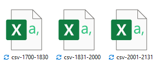

```{r setup,include=FALSE}
options(htmltools.dir.version=FALSE)
knitr::opts_chunk$set(fig.retina = 3,
                      echo = TRUE,
                      eval = TRUE,
                      message = FALSE,
                      warning = FALSE)
```

# 1. Overview

The 2021 Visual Analytics Science and Technology (VAST) Challenge presented researchers with a single fictitious scenario: the disappearance of staff members of the GASTech oil and gas company on location on the island of Kronos. A group named the Protectors of Kronos (POK) was the prime suspect in the disappearance. Three mini-challenges and a grand challenge were offered. For more information, please see [VAST Challenge 2021]( https://vast-challenge.github.io/2021/index.html).

This module will research Mini-Challenge 3 which includes multiple types of text data for participants to feature real-time streaming social media and emergency service data for participants to provide hostage and kidnapper information.This challenge has 3 tasks and questions and asked the participants to integrate results to evaluate the changing levels of risk to the public and recommend actions. 


# 2. Data preparation and Exploration 

### 2.1 Data Source

* There are three dataset provides in Mini-Challenge 3 :

  + Microblog records that have been identified by automated filters as being potentially relevant to the ongoing incident

  + Text transcripts of emergency dispatches by the Abila, Kronos local police and fire departments.

  + maps of Abila and background documents.


* The data of Microblog and text transcripts of emergency dispatches are found in three segments:

  + Segment 1  :"csv-1700-1830.csv" - covers the time period from 1700 to 1830 Abila time on January 23.
  + Segment 2: "csv-1831-2000.csv'- covers the time period from 1830 to 2000 Abila time on January 23.
  + Segment 3: "csv-2001-2131.csv" - covers the time period from 2000 to shortly after 2130 Abila time on January 23. 


### 2.2 Install and load R package

In this module, the tidyverse, ggforce, GGally, plotly R and parcoords packages will be used, which could be seen from below code chunk.


```{r}
packages = c('tidyverse','dplyr','readr','tm','lubridate','wordcloud','SnowballC', 'UpSetR','ggplot2','topicmodels','stringr','clock', 'tidytext','tokenizers','DT')
for (p in packages){
  if(!require(p, character.only = T)){
  install.packages(p)
  }
  library(p,character.only = T)
}
```


### 2.3 Import dataset and combine data

The data of Microblog records and emergency calls are stored in separate csv files. And three csv files share same columns but data generate from different date, which is shown below.

{width=50%}

* Firstly, we need to combine 3 files into one consolidated file, which is necessary for the following analysis. In this step, package 'tidyverse' would be used.The following R code shows the process of data consolidation, then three datasets with different date have been integrated into one file.

```{r}
library(tidyverse)
table1 <- read.csv("csv-1700-1830.csv")
table2 <- read.csv("csv-1831-2000.csv")
table3 <- read.csv("csv-2001-2131.csv")
data <- rbind(table1, table2,table3)
```


* Next, we would separate 'ccdata' and 'mbdata' from "data", they respectively represent microblog record and emergency call center data collected by the Abila, Kronos local police and fire departments.

```{r}
ccdata <- subset(data, type == "ccdata")
mbdata <- subset(data, type == "mbdata")

```


### 2.4  Modifying Date formate  

* converting character objects to dates can be made easier by using the *lubridate* package, which would be used to convert date type from 'yyyymmddhhmmss' to 'yyyy-mm-dd hh:mm:ss', and create a new column 'date' in data, and the code chunk could be seen below.

```{r}
data$date.yyyyMMddHHmmss. <- ymd_hms(data$date.yyyyMMddHHmmss.)

```

* Rename "date.yyyyMMddHHmmss." in data into "date" with concise format.

```{r}
names(data)[names(data) == "date.yyyyMMddHHmmss."] <- "date"
```


### 2.5 Remove Special Chacaters

In this step, we would like to use package *stringr* to clean special characters, including " @, < , ˜ " and none English words. Besides, there are a lot of repeat records which forward from other publisher that begin with "RT". To avoid the affect the word frequency, we move "RT" in ahead.


```{r}
data$message <- str_replace_all(data$message,fixed("@"),"")
data$message <- str_replace_all(data$message,fixed("<"),"")
data$message <- str_replace_all(data$message,fixed("˜"),"")
data$message <- str_replace_all(data$message,"[\u4e00-\u9fa5]+", "")
data$message <- str_replace_all(data$message,fixed("RT"),"")

```


### 2.6 Classify Record

Based on content of data provided, we classified records into three segments, Junk, Spam and Meaningful records, using <span style="color:blue">*stringr*</span> package.

Class| Definition
------|-------------
**Junk**| referred to advertisements or financial purpose reports. The below code chunk is used to identify the spam reports.|
**Meaningful**| refers to informative records which spread real news about ongoing or impending events happen in Aliba.|
**Spam**|represents the no meaningful and irrelevant or inappropriate messages post online.|

* classify Junk records: The str_detect() is used to detect patterns of Junk records. The below code chunk is used to identify the junk reports.|

```{r}
junk <- data %>%
  filter(str_detect(message,"#artists|#badcreadit|#cars
  |#followme|#nobanks|#nobank|#meds|#cancer|#bestfood
  |#workAtHome|#gettingFired|#pharmacyripoff|#iThing
  |homeworkers.kronos|#abilasFinest|#hungry|Easy make.money|
  #iThing|visit this|#eastAbila link|#abilajobs|clickhere|
  #welksFurniture| #swat |#bugs|visit this link|this site")) 

junk <- data %>%
  filter(str_detect(author,"junkman|carjunkers|eazymoney|
  junk99902|junkieduck113|junkman377|junkman995"))
           
```

* Classify Spam records: Using the same way, we detect Spam records by below code chunk.

```{r}
spam <- data %>%
  filter(str_detect(message,"Grammar||#POKlove#Lucio|#getoverit
  |#baa-baa| #HomelessAwareness|#trylove|#pictures
  |#nobodycares|#abilafire|#wishfulthinking|Viktor-E
  |#hogwash|#RememberElian|#standoff|work from home|
  #blackvansrules|#schaber|#abilacityPark|#downwithkronos"))

spam <- data %>%
  filter(str_detect(author,"KronosQuoth|Clevvah4Evah|FriendsOfKronos|
  jaquesjoyce101|klingon4real|michelleR|SaveOurWildlands|
  AbilaAllFaith|footfingers|GreyCatCollectibles|luvwool"))
```


* Classify Meaningful records: Apart from the Spam and Junk, other emails would be  classified into meaningful records, which could be received by the below code chunk.

```{r}
meaningful <- anti_join(data,junk,by="message") 
meaningful <- anti_join(meaningful,spam,by="message")
```

* Next, we add the "class" as a new column to represent the class of every record.

```{r}
junk$class <- "junk"
spam$class <- "spam"
meaningful$class <- "meaningful"

```

* Using below code chunk, we combine Junk, Spam and Meaningful records into one dataframe which was renamed as data_classed.

```{r}
data_classed <- rbind(spam, junk, meaningful)

```

* In the previous pre-processing step, we keep # as a tag to identify Junk, Spam and meaningful records, then we further move "#" in the tag using below code chunk.

```{r}
data_classed$message <- str_replace_all(data_classed$message,fixed("#"),"")
```


### 2.7 Data Tokenization 

In this code chunk below, unnest_tokens() of tidytext package is used to split the dataset into tokens, while stop_words() is used to remove stop-words.

Tokenization step

```{r}
data_classed_token <- data_classed %>%
  unnest_tokens(word, message) %>%
  filter(str_detect(word, "[a-z']$"),
         !word %in% stop_words$word)
```


# 2.8 Data Visualization 

Q1.Using visual analytics, characterize the different types of content in the dataset. What distinguishes meaningful event reports from typical chatter from junk or spam? 

Count the frequent word in all data_class

```{r message=FALSE, include=FALSE}
data_classed_token %>%
  count(word, sort = TRUE)
```


Instead of counting individual words, you can also count words within by class by using the code chunk below. 

```{r echo=TRUE}
token_by_class <- data_classed_token %>%
  count(class, word, sort = TRUE) %>%
  ungroup()
```


```{r}
wordcloud(data_classed_token$word,
          #data_classed_token$n,
          max.words = 200)
```


```{r}
wordcloud(token_by_class$word,
          token_by_class$n,
         max.words = 200)
```

The code chunk below uses bind_tf_idf() of tidytext to compute and bind the term frequency, inverse document frequency and ti-idf of a tidy text dataset to the dataset.


```{r}
tf_idf <- token_by_class %>%
  bind_tf_idf(word,class, n) %>%
  arrange(desc(tf_idf))

```


*Visualising tf-idf as interactive table*


Table below is an interactive table created by using datatable().

```{r}
DT::datatable(tf_idf, filter = 'top') %>% 
  formatRound(columns = c('tf', 'idf', 
                          'tf_idf'), 
              digits = 3) %>%
  formatStyle(0, 
              target = 'row', 
              lineHeight='25%')

```

*Visualising tf-idf as Wordcloud*

```{r}
tf_idf %>%
  #filter(str_detect(class, "^sci\\.")) %>%
  group_by(class) %>%
  slice_max(tf_idf, 
            n = 12) %>%
  ungroup() %>%
  mutate(word = reorder(word, 
                        tf_idf)) %>%
  ggplot(aes(tf_idf, 
             word, 
             fill = class)) +
  geom_col(show.legend = FALSE) +
  facet_wrap(~ class, 
             ncol = 2,
             scales = "free") +
  labs(x = "tf-idf", 
       y = NULL)
```

*Q2*

```{r}
fire_count <- data_classed_token %>% 
  filter(str_detect(word,"fire|Dancing Dolphin Department")) 
```


